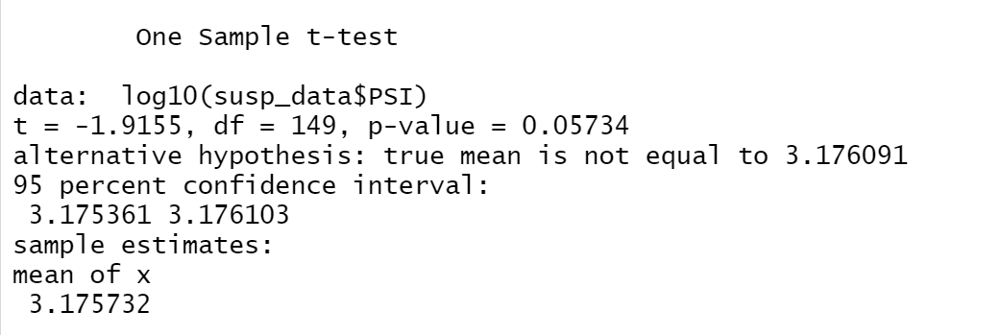

# Module 15 Challenge - MechaCar Statistical_Analysis

## Linear Regression to Predict MPG

### Which variables/coefficients provided a non-random amount of variance to the mpg values in the dataset?
The following variables provided non-random amount of variance to the mpg values in the dataset:

- vehicle_length
- ground_clearance

### Is the slope of the linear model considered to be zero? Why or why not?
The p-value of our multiple linear regression analysis is 5.35e-11; which is much lower than 0.05. There we have sufficient evidence to reject the null hypothesis; which in turn means that the slope of our linear model is not zero.

### Does this linear model predict mpg of MechaCar prototypes effectively? Why or why not?
This linear model should be able to predict mpg of MechaCar prototypes effectively as the Multiple R-Squared value is 0.7149. A higher r-squared value represents how well a model approximates real world data points. This value means that there is a 71.49% probability that the future data points will fit the linear model. See below for the results of the analysis showing high multiple R-squared value.

## Summary Statistics on Suspension Coils

The following screenshots illustrate the Total Summary and Lot Summary.

### Does the data meet specifications?
The overall data shows a variance of 62.29 pounds per square inch and meets the design specifications (ust not exceed 100 pounds per square inch). However, when looking at the manufacturing lots individually we see that Lot1 and Lot2 meet the requirement; however Lot3 does not meet the requirement as the variance is 170.28 pounds per squarce inch. This could indicate a problem with Manufacturing Lot3 which needs to be investigated.

## T-Tests on Suspension Coils

### Comparing PSI across all lots with the population mean of 1,500 PSI

The figure below shows the comparison of all lots against the mean PSI of 1500. We can see that the p-value of 0.05734 shows that we cannot reject the null hypothesis. Therefore the data across the three lots is not statistically different from the population mean.

### Comparing PSI for each manufacturing lot with the population mean

The figures below illustrate the t.test results taking a subset of data, once for each Lot. This shows that Lot1 and Lot2 with p-values of  0.9982 and 0.6115 respectively shows that Lot1 and Lot2 are not statistically different from the population mean of 1500. On the other hand Lot3 shows a p-value of 0.03966, which is below 0.05. This means that Lot3 is in fact statistically different from the population mean.

## Study Design: MechaCar vs Competition

Write a short description of a statistical study that can quantify how the MechaCar performs against the competition. In your study design, think critically about what metrics would be of interest to a consumer: for a few examples, cost, city or highway fuel efficiency, horse power, maintenance cost, or safety rating.

### What metric or metrics are you going to test?
We can use the following metrics to compare MechaCar versus the competition
- City Fuel Efficiency
- Highway Fuel Efficiency
- Horse Power 
- Maintenance Cost
- Safety Rating

### What is the null hypothesis or alternative hypothesis?
Null hypothesis: MechaCar and the competition have similar performance.
Alternative hypothesis: MechaCar performance is different from the competition (either better or worse)

### What statistical test would you use to test the hypothesis? And why?
We can run the two sample t.test to determine if there is a statistical difference between the data for MechaCar versus the competition (separate t.tests for each metric above). If the data shows that there is a statistical difference between Mechacar and the competition it will show whether for that attribute Mechacar is better or worse than the competition.

### What data is needed to run the statistical test?
We would need the following data to run the statistical test:

1. City fuel efficiency of Mechacar and competing models 
2. Highway Fuel Efficiency of Mechacar and competing models
3. Horse Power of Mechacar and competing models
4. Maintenance Cost of Mechacar and competing models
5. Safety Rating of Mechacar and competing models
6. Customer preference data which shows which attributes are considered more important to the consumer on a relative basis (e.g. is Safety rating more important than City fuel efficiency). This data (#6), when combined with #1 to #5 above will show how Mechacar is doing overall.